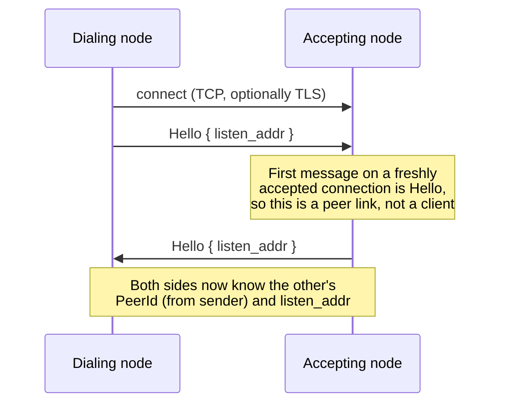
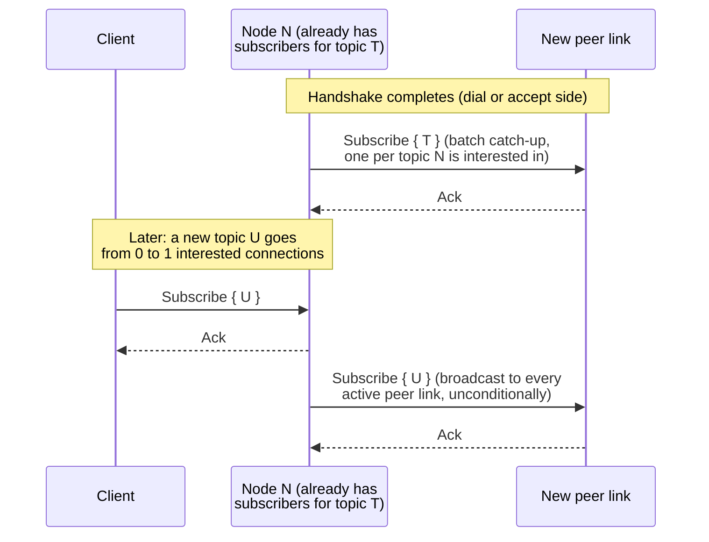
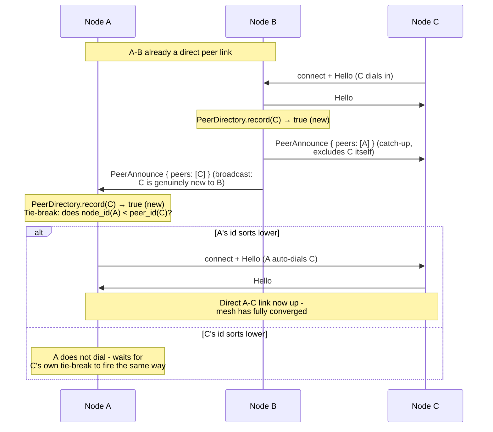
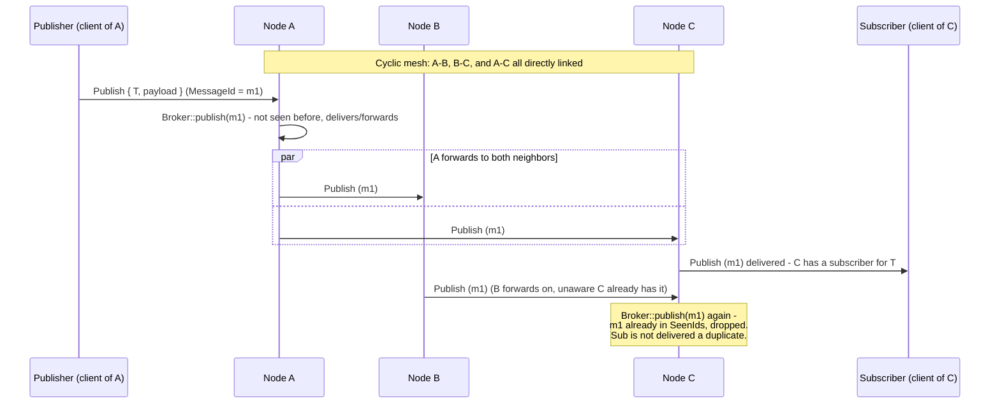
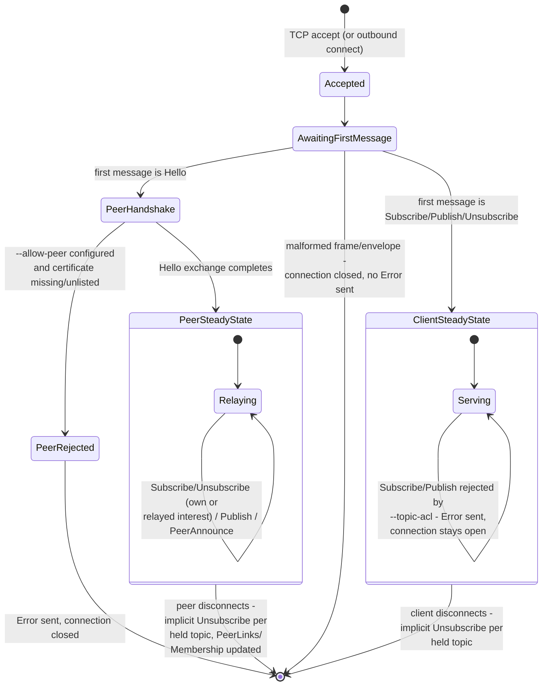

# Flows

`PROTOCOL.md` and the ADRs describe thoth-mesh's runtime behavior in
prose. A few of those flows involve multiple nodes acting
concurrently and are easier to follow as a picture — this page is
diagrams only, cross-linked back to the ADRs that explain the
reasoning behind each one. Not a C4 model: thoth-mesh is one system,
and what's non-obvious here is intra-node/intra-mesh control flow, not
system-to-system boundaries.

**Status:** these track the reference implementation as of the ADRs
cited under each diagram. Like `PROTOCOL.md`, don't assume anything
here holds across a breaking change.

## Peer handshake

The dialing side always speaks first. Both sides learn the other's
`PeerId` (carried on every envelope's `sender` field, not just
`Hello`'s) and the address to dial back, if any. See
[ADR-0009](adr/0009-peer-handshake-shared-port.md).

If an `--allow-peer` allowlist is configured and rejects the far
end's certificate, the rejecting side sends `Error { in_reply_to:
<the Hello's id> }` instead of its own `Hello` and closes the
connection — this can happen on either side, including the dialer
rejecting the accepting side's reply `Hello`. See
[ADR-0017](adr/0017-peer-allowlist-via-tls-fingerprint.md).

## Interest propagation catch-up

A node's interest (aggregated across every client *and* peer
connection) is what gets propagated outward — not each individual
client subscription. A newly-formed peer link is caught up on the
full current snapshot, then kept current by every subsequent
zero-to-one/one-to-zero transition. See
[ADR-0011](adr/0011-interest-propagation-and-loop-prevention.md).

Every peer link a topic transition reaches gets the same
`Subscribe`/`Unsubscribe`, even the peer that caused the transition in
the first place — deliberately not special-cased, since each
connection's own forwarder map is already idempotent and that's what
actually bounds the flood.

## Gossip peer discovery and the auto-dial tie-break

A node only ever dials addresses it's told about (`--peer` or
discovery); this is how it learns about a peer-of-a-peer and closes
the loop into a direct link. See
[ADR-0015](adr/0015-dynamic-peer-discovery-gossip.md).

Both sides evaluate the tie-break independently, from their own local
information, with no coordination — since `PeerId`s are distinct
UUIDs, exactly one side's comparison holds, so exactly one side dials.
A peer learned about via a *direct* `Hello` is never auto-dialed
(there's already a connection); only one learned about *indirectly*,
via `PeerAnnounce`, triggers this.

## Publish delivery across a cyclic mesh

A `MessageId` is generated once and kept unchanged across every hop —
this is what loop prevention and de-duplication key on. See
[ADR-0011](adr/0011-interest-propagation-and-loop-prevention.md).

The same dedup applies to the original local publish, not just
forwarded hops — `Broker::publish` doesn't distinguish "message I just
originated" from "message a peer handed me," which is what makes this
safe on an arbitrary cyclic topology without any per-topology
reasoning.

## Connection lifecycle

There's one listener and one wire format; what a connection *is* — a
plain client or a peer link — is purely behavioral, decided by
whichever message arrives first. See
[ADR-0009](adr/0009-peer-handshake-shared-port.md) and
[ADR-0010](adr/0010-peer-links-share-client-dispatch.md).

The key asymmetry between the two steady states: a peer-link rejection
(`--allow-peer`) always closes the connection, while a client
authorization rejection (`--topic-acl`) never does — a client denied
on one topic may be entitled to others. See
[ADR-0017](adr/0017-peer-allowlist-via-tls-fingerprint.md) and
[ADR-0018](adr/0018-per-topic-client-authorization.md).
